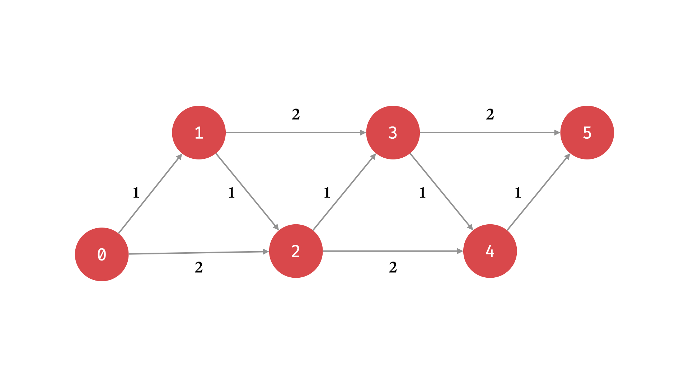

# Algorithms - First Pass Solution

## UPER Problem Solving: P - Process

The plan is for **how** you are going to arrive at the solution. What specific process will you follow that will cause you to arrive at the solution? You need to break down the big problem into a series of smaller, measurable, and actionable steps that you can take. By successfully solving all the smaller problems, you solve the more significant problem.

Planning also allows you to set and achieve smaller goals. Without a detailed plan, you won’t feel any sense of accomplishment until you solve the entire problem. By creating a plan with a series of smaller goals, you allow yourself to receive positive reinforcement and motivation as you complete each small step.

### Example Problem

You are climbing a staircase. It takes `n` steps to reach the top.

Each time, you can either climb 1 or 2 steps. In how many distinct ways can you climb to the top?

Note: Given `n` will be a positive integer.

Input: 2
Output: 2
Explanation: There are two ways to climb to the top.

1. 1 step + 1 step
2. 2 steps

First, let’s break the problem into smaller objectives that we can then tackle one at a time:

**Our Plan**

- Decide if we should use recursion to solve the problem by looking for clues in the problem description.
- Find similar problems that we’ve already solved and analyze those problems to see if they help us solve this problem.
- Draw a diagram for a small input and study the diagram to help understand any potential solutions.
- If we use recursion, discover the base case or base cases.
- If we use recursion, discover the recursive case.
- Write out our algorithm as pseudocode.
- Change each line of pseudocode into actual code.
- Test out our code and see if it is returning the outputs that we would expect.

## UPER Problem Solving: E - Execute

1. Decide if we should use recursion to solve the problem by looking for clues in the problem description.

What clues in the description are there that might lead us to use recursion in our solution? The important wording that jumps out immediately is:

In how many ways can you climb to the top?

Any time we are looking at combinations or permutations (ways of combining or ordering things), it’s an excellent opportunity to use recursion.

So, we’ve completed item number one from our plan and move forward using recursion for this problem.

2. Find similar problems that we’ve already solved and analyze those problems to see if they help us solve this problem.

The connection may not be immediately obvious to you, but this problem is similar to the Fibonnaci problem that you’ve likely encountered in your initial exploration of recursion. How so? Well, to reach the nth step, we are trying to find what the unique possibilities for the previous steps are. We base each current calculation on a combination of previous calculations. In Fibonacci, similarly, we had to compute the nth value by computing `n - 1 + n - 2`. Making this connection now should help as we move forward in our execution.

3. Draw a diagram for a small input and study the diagram to help understand any potential solutions.

Diagrams and drawings can often help lead us to a solution. Let’s try to diagram the solution with an input of 5.



So, for each step, we have two options–we can take one or two steps. By drawing a diagram like this, we can reason about what we are trying to count. For the diagram above, each unique path from step zero to step five represents the thing we are trying to count.


4. If we use recursion, discover the base case or base cases.

Examine the diagram we drew. What would be the base case? The base case would be if the current step we are on is higher than the desired final step (n) or is equal to the desired final step (n). What do we need to return when we hit one of the base cases? Well, remember we are counting paths to get to n. So, if the current step equals n, then we should return 1 to represent one valid path to the desired step. If the current step is higher than n, we went too far, and we should not count that path by returning 0.

So our base cases are:

If the current step is equal to `n`, return `1`.
If the current step is greater than `n`, return `0`.

5. If we use recursion, discover the recursive case.

If we aren’t at a base case, what is the recursive case? Again, looking at the diagram, we have two options: take two steps or take one step. We represent this by a recursive call to our function, but with the current step incremented by one or two.

6. Write out our algorithm as pseudocode.

It’s time to collect all of our current understanding into a pseudocode algorithm.

```python
input to function is current_step and desired_step (both integers):
    if current_step is greater than desired_step:
        return 0
    if current_step is equal to desired_step:
        return 1
```

These are our base cases in pseudocode. Now let’s add our recursive case.

```python
input to function is current_step and desired_step (both integers):
    if current_step is greater than desired_step:
        return 0
    if current_step is equal to desired_step:
        return 1
    return climb_stairs(current_step+1, desired_step) + climb_stairs(current_step+2, desired_step)
```

Now, we have an algorithm represented in pseudocode. Calling back to one of our first steps, you can see how similar this is to the algorithm for finding the nth item in the Fibonacci sequence.

7. Change each line of pseudocode into actual code.

One of the beautiful things about Python is that Python code reads almost like pseudocode. In our case, we have very little to do to convert from pseudocode into actual Python code.

```python
def climb_stairs(current, desired):
    if current > desired:
        return 0
    if current == desired:
        return 1
    return climb_stairs(current+1, desired) + climb_stairs(current+2, desired)
```

8. Test out our code and see if it is returning the outputs we would expect.

Now that we have an actual algorithm to test out, we can test it out to see if it returns the expected output given a specific input. Since we were using an input of 5 for our diagram, we also use that here.


