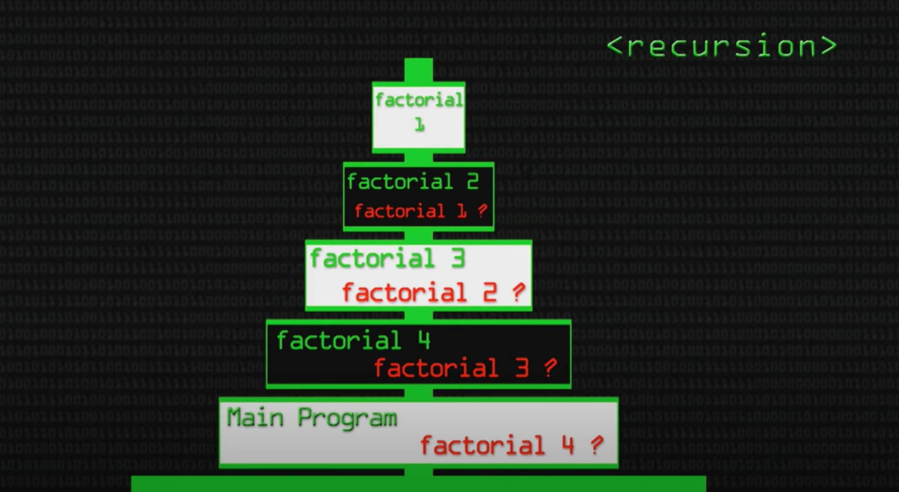
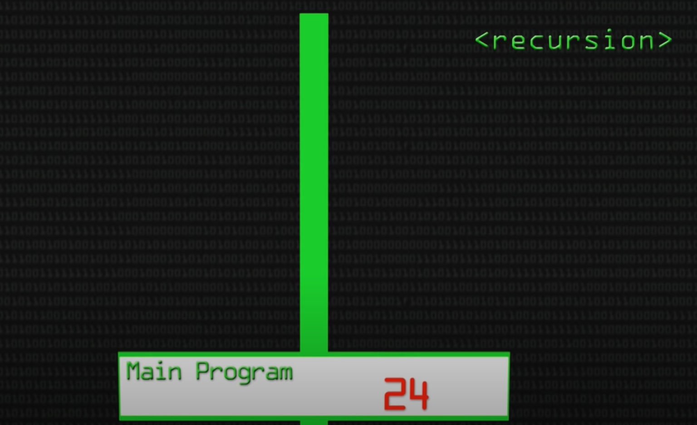
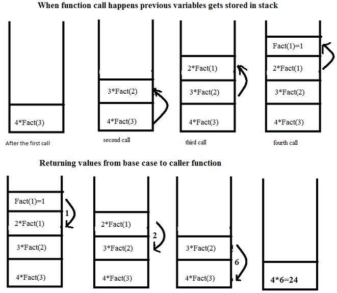
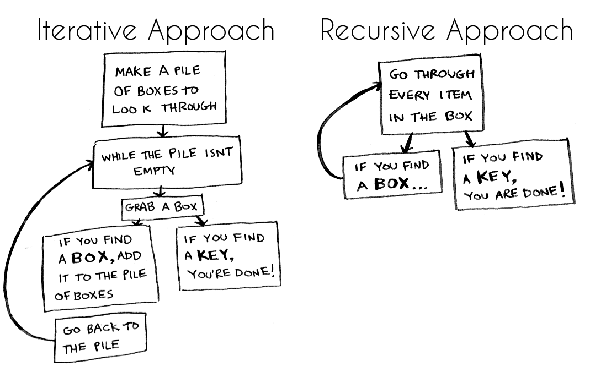

# Algorithms - Recursive Sorting

## What even IS recursion?

A method of solving a problem where the solution depends on solutiions **from** the same problem.

From bottom up, every factorial number seeks the next until we get the answer, 1.



Now we can go from top to bottom until we reach the answer. Facotorial 4 = 24.



## Requirements

- A base case (or cases) that specify when the recursion terminates.
- A rule (or rules) that reduce all other cases towards a base case.

## The Stack



**How the stack is used... basically**

- Recursion requires an allocated stack frame
- For every recursive call; an element is added to the stack
- Once a base case is reached, the last element is "popped" off and the value is passed to the element below it

## Pros vs. Cons

PROS

- Gives a tanible starting point for how to tackle a problem
- Figure out base cases
- Figure out how to get to those base cases
- Clarity: can reduce time and make code easier to debug

CONS

- Mind bending: it takes some time for recurssion to click
- Not performant:
  - less control over how many iterations you want to do - recursion uses more memory because the function to the stack with each recursive call - can be much slower than iteration if not implemented correctly

## Comparison to Iterative



ITERATION

- A funtion repeats a defined process until a condition fails
- This is usually done through a loop, sometimes with a counter and comparative statement
- An infinite loop occurs when the condition never fails

RECUSION

- The function calls itself repeatedly until a certain condition is met
- The base case is explicity state to return a specific value when condition is met
- An infinite loop occurs when the input doesn't converge on the base case

## When To Use

Look for keywords or phrases like the following:

- Compute the nth term of...
- List the first n terms of...
- Generate all possible permutations...

## Example

```python
def factorial(number):
	# base case
	if number == 1:
		return 1

	# moving towards base case
	return number * factorial(number - 1)


print('factorial of 7 is: ', factorial(7))
#  factorial of 7 is: 5040
```
