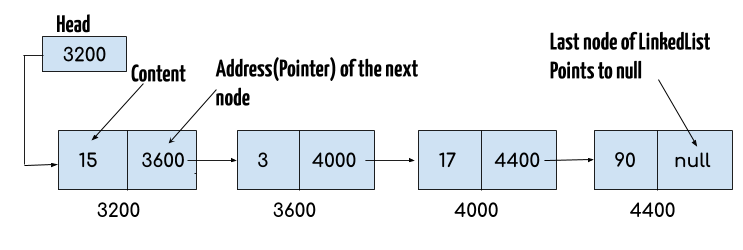
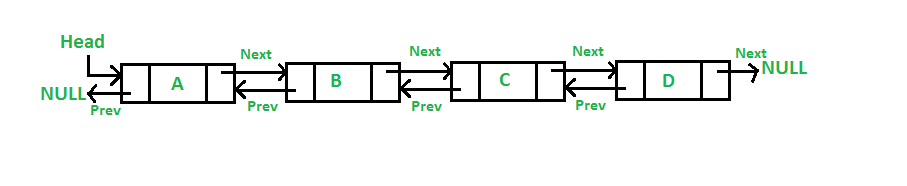

# Data Structures II

## Linked Lists



```python
class Node:
	def __init__(self, next=None, prev=None, data=None):
		self.next = next
		self.prev = prev
		self.data = data

class doubly_linked_list:
	def __init__(self):
		self.head = None
```

## Doubly Linked List



PROS

- Can be traversed both forward and backward
- Delete operation is more efficient (because the pointer to the previous node is given)
- Quicker to insert before a given node

CONS

- Every node requires extra space to house the previous pointer
- All operations require both previous and next pointers to be maintained

```python
class Node:
	def __init__(self, next=None, prev=None, data=None):
		self.next = next
		self.prev = prev
		self.data = data

class doubly_linked_list:
	def __init__(self):
		self.head = None
```

### Why Arrays Are Better

Retreiving values

- Grabbing a value by index from an array has a time complexity of O(1)
- Grabbing a value from a linked list has a time complexity of up to O(n)
- A linked list doesn't have direct access to any of its nodes an array can reference any index directly

Cache Friends

- Caches are typically optimized to work with contiguous memory access

### Why Linked Lists Are Better

Space Complexity

- A linked list only needs to be the size of the data that it contains
- An array must first allocate space in memory to store the items contiguously
- This memory remains unavailable whether it is used or not
- We can keep adding nodes to a linked list without worrying about allocating more space

Inserting Values

- When inserting a new node you only need to change the next value of the node before it
- When inserting a new index you need to shift all proceeding values to keep

### Single vs. Doubly Linked Lists

#### Drawbacks of a Singly linked list

- Unidirectional traversal meant that removing a node from the end of a singly linked list is a linear operation instead of a constant-time operation.
- Getting to any position in a singly-linked list requires traversing from the head of the list, even if the position we want to get to is physically closer to the tail.
