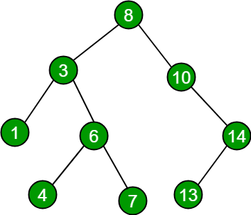

# Data Structures III

## Terminology

Root: The topmost node in the tree.

Child: A node directly connected to another node when moving away from the root node.

Parent: A node directly connected to another node when moving towards the root node.

Siblings: Nodes that share the same parent.

Leaf: A node that does not have any child nodes.

Traversing: Reading or processing the data of a node exactly once in some order in a tree.

## Pros and Cons of Search Trees

PROS

- Optimized for searches
- Significantly more efficient than searching through an array or linked list

CONS

- Not as efficient to insert into a binary search tree
- Performance depends on if the tree is "balances" or not

## Binary Search Trees



A tree where each node can point to at most two other node.

For any given node:

- All children values to left are less than the value of the given node.
- All children values to the right are more than or equal to the value of the given node.

```python
class Node:
    def __init__(self, data):
        self.data = data
        self.left = None
        self.right = None

def tree_util(preorder, low, high, size):
    # if preorder index is greater than the size of the preorder
    # or lowest possible value is higher than the highest possible
    if tree_util.preorder_index >= size or low > high: return None

    # create a node with current preorder index value
    root = Node(preorder[tree_util.preorder_index])
    # increment preorder index value
    tree_util.preorder_index += 1

    # if low == high there is only 1 index; no need to recur
    if low == high: return root

    # search for the first element greater than root
    for i in range(low, high+1):
        if preorder[i] > root.data: break

    # divide preorder array into two parts using the preorder index
    root.left = tree_util(preorder, tree_util.preorder_index, i-1, size)
    root.right = tree_util(preorder, i, high, size)

    return root

def construct_tree(preorder):
    size = len(preorder)
    tree_util.preorder_index = 0
    return tree_util(preorder, 0, size-1, size)
```
