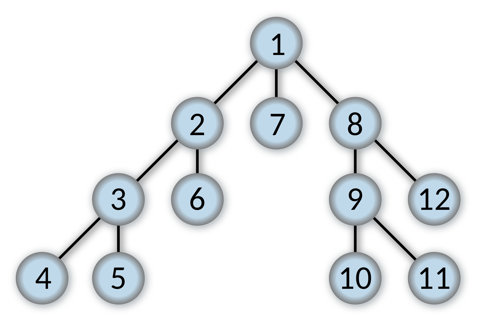

# Data Structures IV

## Terminology

**Search**: completed when the target of the search is found.

**Traversal**: completed when every node has been explored.

**Depth First Traversal (DFT)**: is one that continues traveling forward on each branch until a dead end is reached. The search then retreats to the first unexplored branch and follows the next unexplored path until that one too reaches a dead end. This continues until all nodes have been visited. Think of it like being in a maze and always turning right at each intersection. We can do a DFT recursively or iteratively. The iterative approach makes use of stack.

**Breadth First Traversal (BFT)**: takes the opposite strategy. We explore layer by layer, slowly moving outward from the starting point. At each node, we add every node we discover to the list of nodes to explore, then explore them in the order in which we encounter them. For this, we use a queue. This means we’ll jump around a bit - the next node we visit might not be directly connected to the one we are on.

