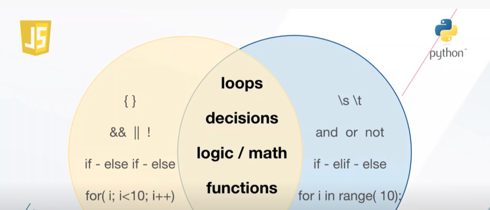
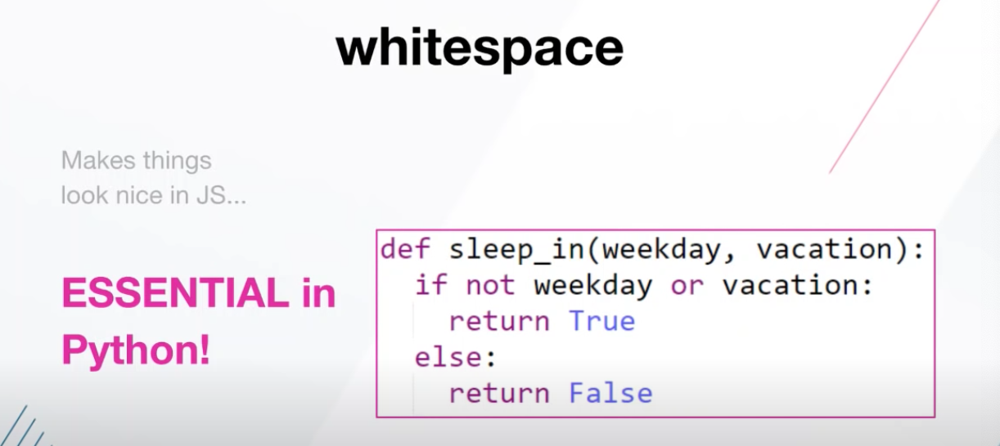
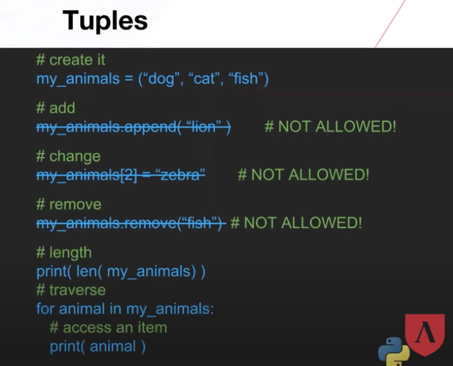

# Intro To Python



## Arithmetic Operators

Operators are special symbols that represent computations like addition and multiplication.

- `**`: exponentiation
- `^`: exclusive-or (bitwise)
- `%`: modulus
- `//`: divide with integral result (discard remainder)

```python
>>> 30 + 6
36
>>> 40 - 4
36
>>> 6 * 6
36
>>> 72 / 2
36.0
>>> 6**2
36
>>> 36 % 35
1
>>>
```

## Exponentiation(\*\*)

Raises the first number to the power of the second.

The ** operator does exponentiation. a ** b is a raised to the b power. The same \*\* symbol is also used in function argument and calling notations, with a different meaning (passing and receiving arbitrary keyword arguments).

```python
f4(city="Berkeley", population=121240, founded="March 23, 1868")

d = {
    "monster": "goblin",
    "hp": 3
}

# How do you have to modify the f4 call below to make this work?
f4(**d)
```

### **Python Arbitrary Arguments**

Python allows us to have the arbitrary number of arguments. This is especially useful when we are **not sure in the advance** that how many arguments, the function would require.

We define the arbitrary arguments while defining a function using the **asterisk (\*)** sign.

```python
a = [7, 6, 5, 4]

# How do you have to modify the f2 call below to make this work?
print(f2(*a))    # Should print 22
```

## Strings, Integers, and Floats

- Ints (Integers): (6) - a whole number/ positive or negative. No decimals.
- Floating or Floating Point: 5.2, 1.333, 0.0 - this takes up a lot more space than a whole number. If we include decimals, there are an infinite number of numbers between two whole numbers.
- String: `'Hello, World!'`

Python can tell you:

```python
>>> type(6)
<class 'int'>
>>> type(36.0)
<class 'float'>
>>> type('Hello, World!')
<class 'str'>
>>>
```

## Variables

Containers that store data to be used later. Hold numbers, booleans, strings, etc. It is a named symbol that holds a value. Kind of like a safe.

```python
X = 500
tomHardy = 1
Print (tomHardy+ x) = 501
```

## Whitespace



No brackets. You can use tabs, but you can't mix tabs and spaces.

### Python Collections

**Lists**

Group of items we reference by index.

- Mutable. (We can change the contents)
- Duplicate items.

```python
# create it
my_colors = ["red", "orange", "yellow"]

# add vs. insert
# add to end
my_colors.appends("green")
# insert at i
my_colors.insert(2, "blue")

# remove vs. pop vs. del
# removes item
my_colors.remote("orange")
# removes last item
my_colors.pop()
# removes item at i
del my_colors[1]

# traverse
for i in range ( 0, len(my_colors) ):
# access an item
print(my_colors[i])
```

**List Slices**

```python
my_colors = ["red", "orange", "yellow"]

# 1st item you want vs. 1st item you DON'T want
primary_colors = my_colors[0:2]
# colors will contain red and yellow only

# 1st item you want goes to end
primary_colors = my_colors[1:]

# 1st item you DON'T want starts at beginning
primary_colors = my_colors[:2]
```

**List Comprehensions**

```python
my_colors = ["red", "yellow", "orange", "blue", "green"]

# returns new new list of colors with less # than 5 chars

new_colors = [c for c in my_colors if len(c) < 5]
```

**Tuples**

Group of items we reference by index.

- Immutable.
- Duplicate items.
- Always in ()



**Sets**

Unordered group of items.

- Mutable (cannot CHANGE, only ADD)

- NO duplicate items.

```python
# create it
my_cities = {"Dallas", "Houston", "Austin" }

# add
my_cities.add("San Antonio")
my_cities.update(["Boerne", "Galveston"])

# change - NOT ALLOWED
my_cities[2] = "El Paso"

# remove
my_cities.remove("Houston")
# remove last item
my_cities.pop()

# length
print(len(my_cities))
# tarverse
for city in my_cities) ):
# access an item
print(city)
```

**Dictionaires**

Group of values we reference through their keys.

- Mutable.
- Duplicate items.

```python
# create it
my_grades = {
# "key" : "value",
"Math": 88,
"Science": 85,
"English": 91,
"History": 92
}

# access
print(my_grades.get("History"))

# add
# use new key
my_grades["Art"] = 81

# change
my_grades["English"] = 93

# remove specific item
my_grades.pop("Science")
# remove last item
my_grades.popitem()

# length
print (len(my_grades) )

# traverse
for grade in my_grades:

#access an item
print(grade + ":" + my_grades[grade])

```
