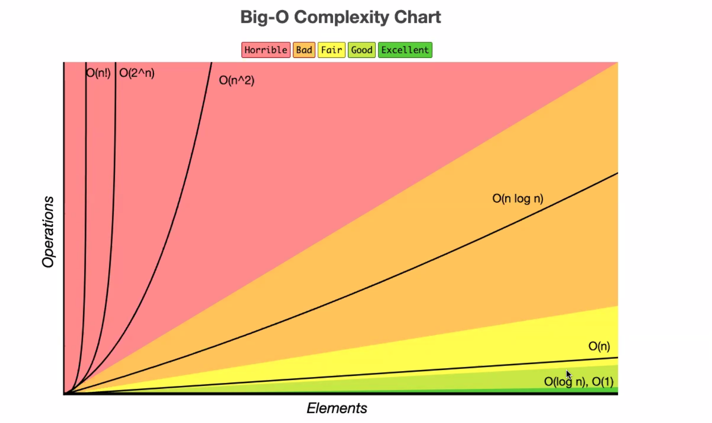
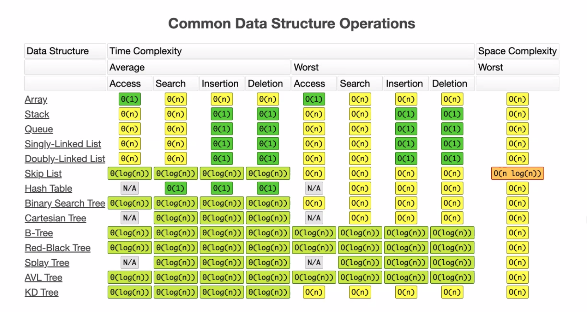

# 7-21-20 Lecture

## Complexity Chart

## Common Data Structure Operations

Good references:
https://www.bigocheatsheet.com/
https://runestone.academy/runestone/books/published/pythonds/index.html

## Arrays

- When used in Python, it adds some space in case the list grows.
- Linked Lists are better when dealing with adding new items.
- These are typically linear notation. (So, not great.)
