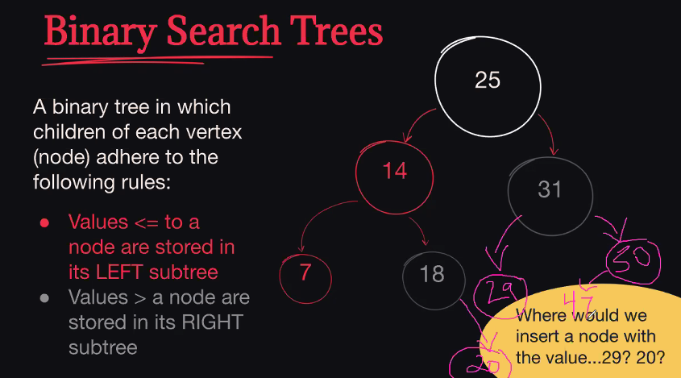

# 7-27-20

**How do you reverse a singly linked list without recursion? You may not store the list, or it's values, in another data structure.**

```python

def reverse_ll(self):
    cur_node = self.head
    next_node = cur_node.next
    cur_node.set_next(None)
    self.tail = cur_node
    while next_node is not None:
        prev_node = cur_node
        cur_node = next_node
        next_node = cur_node.get_next()
        cur_node.set_next(prev_node)
    self.head = cur_node


ll = LinkedList()
ll.add_to_tail(1)
ll.add_to_tail(2)
ll.add_to_tail(3)
ll.add_to_tail(4)
ll.add_to_tail(5)
print(ll.find_middle())
```

## Binary Search Trees



### Plan for starting Binary Search Tree project


